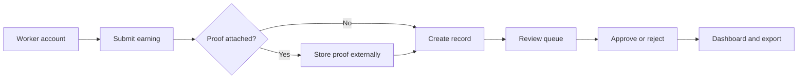

<p align="center">
  
</p>

<h1 align="center">RozGo</h1>

<p align="center">
  A full-stack income record and verification platform for independent workers.
</p>

<p align="center">
  <a href="https://frontend-eight-drab-56.vercel.app">
    
  </a>
</p>

<p align="center">
  
</p>

---

## Overview

RozGo helps independent workers keep organized earning records and gives reviewers a clean way to verify submitted entries.

The core workflow:

- A worker creates an account.
- The worker submits an earning record.
- Optional proof can be attached.
- A reviewer checks the submission.
- Verified records power the worker dashboard and exports.

---

## Core Features

### Worker side

- Account creation and sign-in.
- Earning submission form.
- Optional proof attachment.
- Personal earnings dashboard.
- Status-based earning history.
- Summary stats, charts, and PDF export.

### Reviewer side

- Separate reviewer access flow.
- Pending submission queue.
- Approve or reject submitted earnings.
- Optional review comments.
- Review summary dashboard.

### Interface

- Responsive React UI.
- Premium animated landing page.
- Glass-style cards and panels.
- Smooth page transitions.
- Scroll-triggered reveals.
- Magnetic buttons and floating cards.

---

## Stack

| Area | Tools |
|---|---|
| Frontend | React, Vite, Tailwind CSS |
| Motion | Framer Motion, CSS animations |
| Backend | Node.js, Express |
| Data | Document database with Mongoose models |
| Access | Protected account flows |
| Uploads | External media storage |
| Email | Account verification |
| Export | PDF generation |

---

## Project Structure

```txt
RozGo
├── frontend/
│   ├── src/pages/
│   ├── src/components/
│   ├── src/context/
│   └── src/index.css
│
└── backend/
    ├── server.js
    └── src/
        ├── models/
        ├── controllers/
        ├── routes/
        ├── middleware/
        ├── config/
        └── utils/
```

---

## App Flow



---

## Local Development

Use your own local configuration values. Do not commit private credentials.

### Backend

```bash
cd backend
npm install
npm run dev
```

### Frontend

```bash
cd frontend
pnpm install
pnpm run dev
```

---

## Notes

- Runtime credentials are intentionally not documented here.
- Only the public website link is listed in this README.
- Internal paths and service routes are intentionally not listed here.
- Use environment variables for database, auth, email, upload, and client configuration.

---

<p align="center">
  <strong>RozGo turns scattered gig work into organized, reviewable income records.</strong>
</p>
