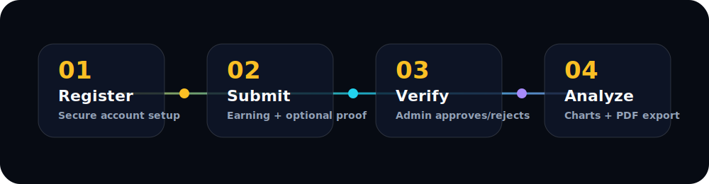
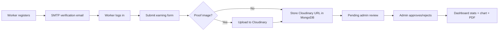

<p align="center">
  
</p>

<p align="center">
  <a href="https://frontend-eight-drab-56.vercel.app"></a>
  <a href="https://backend-eight-gules-9jmr85cnzq.vercel.app/api/health"></a>
  
  
  
</p>

<h1 align="center">RozGo — Verified Gig Income Tracker</h1>

<p align="center">
  A production-deployed MERN-style platform where gig workers submit income records, upload proof, and admins verify earnings before they appear in analytics.
</p>

<p align="center">
  <strong>Worker submits earning → Cloudinary stores proof → Admin verifies → Dashboard updates → PDF export</strong>
</p>

<p align="center">
  
</p>

---

## What RozGo Does

RozGo solves a practical problem for freelancers and gig workers: income comes from many sources, proof is scattered, and records are hard to trust later.

The app creates a verified earning history:

- Workers register and verify email.
- Workers add earning entries with amount, source, date, description, and optional screenshot proof.
- Proof images are uploaded to Cloudinary.
- Admins review pending entries from a separate admin portal.
- Approved earnings feed the dashboard, monthly charts, and PDF export.

---

## Live Production

| Surface | URL |
|---|---|
| Frontend | https://frontend-eight-drab-56.vercel.app |
| Backend health | https://backend-eight-gules-9jmr85cnzq.vercel.app/api/health |
| Admin route | https://frontend-eight-drab-56.vercel.app/admin |

---

## Tech Stack

| Layer | Tech |
|---|---|
| Frontend | React 18, Vite, Tailwind CSS |
| Motion/UI | Framer Motion, custom glass/aurora CSS, Lucide icons |
| Backend | Node.js, Express.js |
| Database | MongoDB Atlas, Mongoose |
| Auth | JWT, bcrypt password hashing, role-based middleware |
| Email | Nodemailer SMTP verification |
| Uploads | Multer + Cloudinary |
| Charts/PDF | Chart.js, react-chartjs-2, jsPDF, jspdf-autotable |
| Deployment | Vercel frontend + Vercel serverless backend |

---

## Feature Map

### Worker

- Register with email verification.
- Login with JWT session.
- Add earning entries.
- Upload optional proof screenshots.
- View earnings by status.
- Delete non-approved entries.
- See dashboard stats and monthly breakdown.
- Export verified income as PDF.

### Admin

- Separate `/admin/login` portal.
- Admin-only protected APIs.
- View submitted earnings.
- Filter by status.
- Approve or reject entries.
- Add admin comments.
- See admin-level stats.

### Platform

- CORS configured for Vercel frontend/backend.
- MongoDB Atlas production database.
- Cloudinary-backed proof image storage.
- SMTP-backed verification emails.
- Serverless-ready backend deployment.

---

## Architecture

```txt
RozGo
├── frontend/
│   ├── src/pages/          # Landing, login, register, dashboard, admin
│   ├── src/components/     # Cards, charts, nav, motion effects
│   ├── src/context/        # Auth context
│   └── src/index.css       # Tailwind + premium visual system
│
└── backend/
    ├── server.js           # Express app + CORS + route mounting
    ├── src/models/         # User, Earning schemas
    ├── src/controllers/    # Auth, earnings, admin logic
    ├── src/routes/         # API routes
    ├── src/middleware/     # JWT auth + upload middleware
    ├── src/config/         # MongoDB + Cloudinary config
    └── src/utils/          # SMTP email utility
```

---

## Data Flow



---

## Motion + Visual System

The frontend is not just static Tailwind cards. It includes a motion layer built with Framer Motion and custom CSS:

- Animated aurora background.
- Floating blurred orbs.
- Scroll progress bar.
- Page transitions with `AnimatePresence`.
- Character-by-character hero reveal.
- Scroll-triggered reveals.
- Cursor-reactive tilt cards.
- Magnetic buttons.
- Floating badges.
- SVG outline tracing.
- Glassmorphism panels with real `backdrop-filter`.
- Gradient borders, shimmer, reflections, and hover elevation.

Key file:

```txt
frontend/src/components/MotionFX.jsx
```

This keeps motion reusable instead of scattering one-off animations through every page.

---

## API Overview

### Auth

```txt
POST /api/auth/register
POST /api/auth/login
POST /api/auth/admin/login
GET  /api/auth/verify-email/:token
POST /api/auth/resend-verification
GET  /api/auth/me
```

### Earnings

```txt
GET    /api/earnings
POST   /api/earnings
DELETE /api/earnings/:id
GET    /api/earnings/stats
```

### Admin

```txt
GET   /api/admin/earnings
PATCH /api/admin/earnings/:id
GET   /api/admin/stats
```

---

## Local Setup

### 1. Clone

```bash
git clone https://github.com/aswab007-ops/RozGo.git
cd RozGo
```

### 2. Backend

```bash
cd backend
npm install
npm run dev
```

### 3. Frontend

```bash
cd frontend
pnpm install
pnpm run dev
```

---

## Environment Variables

### Backend

```env
MONGO_URI=
JWT_SECRET=
CLIENT_URL=

CLOUDINARY_CLOUD_NAME=
CLOUDINARY_API_KEY=
CLOUDINARY_API_SECRET=

SMTP_HOST=smtp.gmail.com
SMTP_PORT=465
SMTP_SECURE=true
SMTP_USER=
SMTP_PASS=
SMTP_FROM=
SMTP_FROM_NAME=RozGo
```

### Frontend

```env
VITE_API_URL=
```

Do not commit real secrets.

---

## Interview Pitch

> RozGo is a full-stack income verification platform for gig workers. Workers submit earning records with optional proof screenshots, admins verify or reject them, and approved entries power charts, stats, and PDF exports. I built it with React, Express, MongoDB Atlas, JWT auth, Cloudinary uploads, SMTP email verification, and deployed it on Vercel.

---

## Technical Talking Points

### Why Cloudinary?

Vercel serverless deployments cannot rely on persistent local file storage. Proof images are uploaded to Cloudinary, and MongoDB stores only the image URL.

### How auth works

Passwords are hashed with bcrypt. Login returns a JWT. Protected backend middleware verifies the token and attaches the user to the request. Admin routes also check `role === "admin"`.

### How email verification works

Registration creates a short-lived JWT verification token. Nodemailer sends a verification link. The backend verifies the token and marks the user as verified. If SMTP sending fails, the half-created unverified user is deleted so they can retry cleanly.

### How admin review works

New earnings start as `pending`. Admins can approve or reject them. Only approved earnings are counted in the worker’s verified income totals.

### How animations were added

Framer Motion handles spring interactions, page transitions, scroll transforms, character reveals, and tilt cards. CSS handles glass, aurora, gradient borders, shimmer, and reflection effects.

---

## Status

Production ready:

- Frontend deployed.
- Backend deployed.
- MongoDB Atlas connected.
- Cloudinary uploads enabled.
- SMTP verification enabled.
- Admin and worker flows separated.

---

<p align="center">
  <strong>RozGo turns scattered gig work into verified income history.</strong>
</p>
